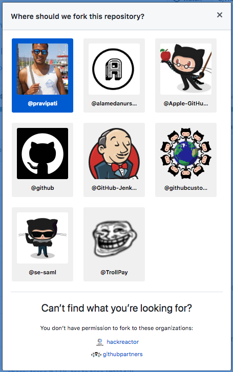
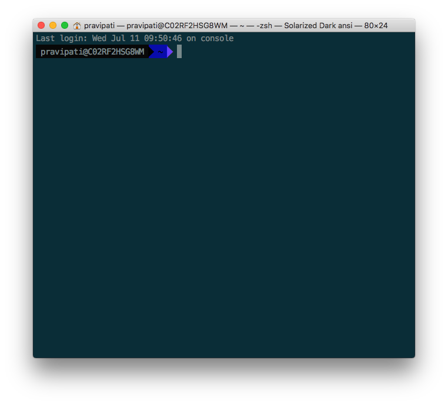

# sdr-code-camp
learn you some code!

## Build and deploy a website

### Setup

Before you can begin, make sure you go download the following:

* [GitHub Desktop](https://desktop.github.com/)
* [Atom IDE](https://ide.atom.io/)

Once you’ve done that, you’ll need to fork the [sdr-code-camp](https://github.com/pravipati/sdr-code-camp) repo. Be sure to fork it under your username!

### Getting to know your Terminal

Great! You’re all set up now. 

Have you seen this before? If not have no fear! It’s just your friendly computer terminal. 

> Peeling back the onion: most of the time when you use your computer, you’re clicking around on different menus, icons, or applications; all of these are a part of the GUI, or the _graphical user interface_. The terminal has what is known as a CLI, or a _command-line interface_. There’s tradeoffs with using either interface—the GUI makes it really easy to run a bunch of different tasks in parallel and, generally speaking, keeps you within the confines of how a particular application was designed. Conversely, a CLI is trickier when it comes to running multiple tasks at the same time, but you can re-imagine how apps function  and customize the inputs or outputs to suite your specific needs. A great analogy for GUI vs. CLI would be automatic vs. manual mode on a camera. A good amount of the time automatic mode will help you get a decent photograph and while it’s very rare that you will get a totally unusable photo, you often might find that the final photo didn’t match what you were going for. With manual mode, there’s more of a learning curve so in the beginning your photo quality will suffer. With a little practice though, you’ll be able to take pictures that truly surpass what you were able to do with full Auto. 

To find your terminal, hold the `⌘` button and press your spacebar. Once the spotlight search comes up, type in `Terminal` and press `Enter`.

Great! Now you have access to your Terminal’s prompt. At this point you can run commands in your terminal to do things.

**Definition**: **Commands**: A command is an instruction given by a user telling a computer to do something, such as run a single program or a group of linked programs. 

> Protip: if you’re curious to learn more about what a command in this tutorial means, type in `man [COMMAND]` swapping about `[COMMAND]` with the name of the command you want to learn more, i.e. `man ls`. The terminal will take you into the manual page for that command which you can scroll through using `j` and `k`. Once you’re done, type `q`. 

#### Command Cheat Sheet

**Core Commands**

| Command | Description|
|---------|-------------|
| cd | Home directory |
| cd [folder] | Change directory |
| cd ~ | Home directory, e.g. 'cd ~/folder/' |
| cd / | Root of drive |
| ls | Short listing |
| ls -l | Long listing |
| ls -a | Listing incl. hidden files |
| ls -lh | Long listing with Human readable file sizes |
| ls -R | Entire content of folder recursively |
| sudo [command] | Run command with the security privileges of the superuser (Super User DO) |
| open [file] | Opens a file |
| open . | Opens the directory |
| top | Displays active processes. Press q to quit |
| nano [file] | Opens the Terminal it's editor |
| pico  [file] | Opens the Terminal it's editor |
| q | Exit |
| clear | Clear screen |

**File Management**

| Command | Description|
|---------|-------------|
| touch [file] | Create new file |
| pwd | Full path to working directory |
| .. | Parent/enclosing directory, e.g. |
| ls -l .. | Long listing of parent directory |
| cd ../../ | Move 2 levels up |
| . | Current folder |
| cat | Concatenate to screen |
| rm [file] | Remove a file, e.g. rm [file] [file] |
| rm -i [file] | Remove with confirmation |
| rm -r [dir] | Remove a directory and contents |
| rm -f [file] | Force removal without confirmation |
| rm -i [file] | Will display prompt before |
| cp [file] [newfile] | Copy file to file |
| cp [file] [dir] | Copy file to directory |
| mv [file] [new filename] | Move/Rename, e.g. mv -v [file] [dir] |

**Directory Management**

| Command | Description|
|---------|-------------|
| mkdir [dir] | Create new directory |
| mkdir -p [dir]/[dir] | Create nested directories |
| rmdir [dir] | Remove directory ( only operates on empty directories ) |
| rm -R [dir] | Remove directory and contents |

Got all that? Great! Let’s build something now.

Type in `cd ~/Desktop`. This will take you to 
